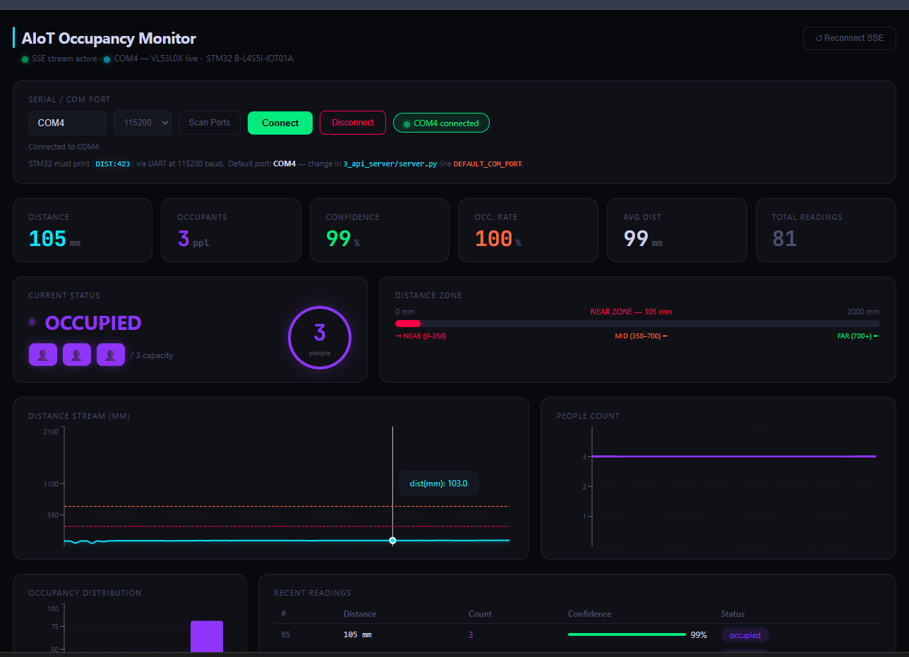

# AIoT Occupancy Detection & Estimation System
## Board: B-L4S5I-IOT01A | Sensor: VL53L0X ToF

---

## Project Structure

```
AIoT_Occupancy/
├── 1_collect_data/
│   ├── collect_serial.py      ← Collect data from STM32 via USB/UART
│   ├── collect_wifi.py        ← Collect data from STM32 via WiFi
│   └── sample_dataset.csv     ← Sample dataset (500 rows)
│
├── 2_train_model/
│   ├── train_occupancy_model.py  ← Full training pipeline
│   └── models/                   ← Auto-created after training
│       ├── classifier.pkl
│       ├── estimator.pkl
│       └── model_meta.json
│
├── 3_api_server/
│   └── server.py              ← FastAPI backend (connects model to frontend)
│
├── 4_frontend/
│   ├── package.json
│   ├── index.html
│   └── src/
│       ├── main.jsx
│       ├── App.jsx
│       └── index.css
│
└── 5_stm32_firmware/
    └── wifi_sender.c          ← USER CODE to add to STM32CubeIDE main.c
```

---

## Quick Start (Run in Order)

### Step 1 — Install Python dependencies
```bash
pip install pyserial pandas numpy scikit-learn joblib fastapi uvicorn requests
```

### Step 2 — Collect real sensor data (choose one)
```bash
# Option A: USB Serial (easier, no WiFi needed)
python 1_collect_data/collect_serial.py --port COM3 --samples 500

# Option B: WiFi (board must be running wifi_sender firmware)
python 1_collect_data/collect_wifi.py --ip 192.168.1.42 --samples 500
```
Both save to: `1_collect_data/dataset.csv`

### Step 3 — Train the AI model
```bash
python 2_train_model/train_occupancy_model.py 1_collect_data/dataset.csv
```
Models saved to `2_train_model/models/`

### Step 4 — Start the API server
```bash
cd 3_api_server
uvicorn server:app --host 0.0.0.0 --port 8000 --reload
```
Test it: http://localhost:8000/health

### Step 5 — Start the React frontend
```bash
cd 4_frontend
npm install
npm run dev
```
Open: http://localhost:5173

---

## STM32 Firmware (WiFi Mode)
See `5_stm32_firmware/wifi_sender.c` for the exact USER CODE blocks
to paste into your STM32CubeIDE project.

---

## Data Flow
```
VL53L0X ──I2C2──> STM32L4S5 ──USB/WiFi──> collect_*.py
                                                 │
                                          dataset.csv
                                                 │
                                    train_occupancy_model.py
                                                 │
                                    classifier.pkl + estimator.pkl
                                                 │
                                          server.py (FastAPI :8000)
                                                 │
                                    React Dashboard (:5173)
```

